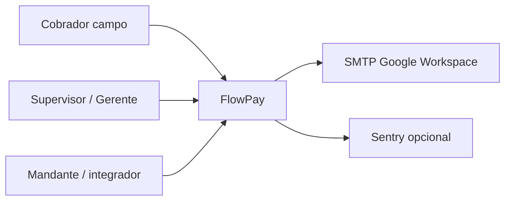
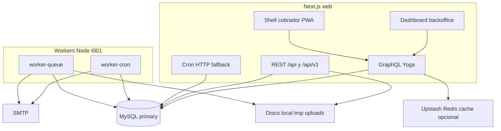

# Arquitectura C4 — FlowPay (I010)

Documento vivo alineado al código (v1.2.8). Actualizar con cada cambio de contenedores.

## Nivel 1 — Context

## Nivel 2 — Containers

### Jobs del cron maestro (`operaciones-cobranza`)

Fuente: `src/lib/cron/cron-registry.ts`

- Recálculo mora, castigo, promesas, secuencias, digests, retención, etc.
- Incluye **`digest_email_supervisores`** (SMTP)
- Importaciones: cron diario `07:00` + on-demand + **worker-queue**

### Diferido por costo

- Object storage S3/Azure (I003 / PP-2)
- Read replica MySQL (I004 / SC-1)
- BullMQ/Redis/SQS como cola (I002 → cola MySQL gratuita)

## Relacionado

- [ARCHITECTURE-BOUNDED-CONTEXTS.md](./ARCHITECTURE-BOUNDED-CONTEXTS.md)
- [ADR-001-MULTI-TENANT.md](./ADR-001-MULTI-TENANT.md)
- [CATALOGO-PROCESOS.md](./catalogos/CATALOGO-PROCESOS.md)
