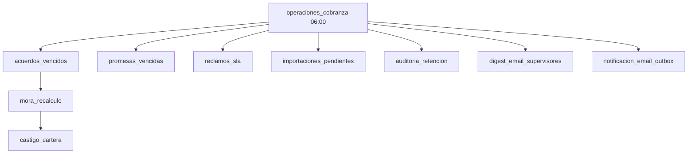

# Catálogo de Procesos — FlowPay

Procesos operativos manuales y automáticos.

---

## 1. Procesos manuales

### P-01 Importación de cartera

| Paso | Actor | Sistema |
|------|-------|---------|
| 1 | Supervisor | Selecciona mandante y plantilla |
| 2 | Supervisor | Sube Excel |
| 3 | Sistema | Encola job async (`tbl_importacion_job`) |
| 4 | Sistema | Procesa filas: alta/actualización préstamos y clientes |
| 5 | Supervisor | Revisa historial de cargas |

**Rutas:** `/cobranza/importar`, `/cobranza/historial-cargas`  
**Servicio:** `importacion-job-service.ts`, `cartera-carga-service.ts`

---

### P-02 Asignación de cartera

| Paso | Actor | Sistema |
|------|-------|---------|
| 1 | Supervisor | Filtra préstamos sin gestor o por criterio |
| 2 | Supervisor | Selecciona cobrador |
| 3 | Sistema | Actualiza `idgestorAsignado` |

**Ruta:** `/cobranza/asignacion`  
**Servicio:** `asignacion-cartera-service.ts`

---

### P-03 Ciclo de gestión diaria

| Paso | Actor | Sistema |
|------|-------|---------|
| 1 | Cobrador | Consulta Mi día / Bandeja |
| 2 | Cobrador | Contacta deudor (respeta horario) |
| 3 | Cobrador | Registra gestión o promesa |
| 4 | Cobrador | Registra pago si aplica |
| 5 | Cobrador | Imprime comprobante (`/cobranza/pagos/{id}/comprobante`) |
| 6 | Sistema | Actualiza timeline y KPIs |

**Servicios:** `bandeja-cobrador-service.ts`, `mi-dia-service.ts`, `gestion-*`, `comprobante-pago-service.ts`

---

### P-04 Acuerdo de pago

| Paso | Actor | Sistema |
|------|-------|---------|
| 1 | Cobrador | Simula acuerdo |
| 2 | Cobrador/Supervisor | Crea acuerdo (aprobación si descuento alto) |
| 3 | Sistema | Transición estado → Con acuerdo |
| 4 | Sistema | Cron evalúa cuotas vencidas |

**Servicios:** `acuerdo-simulator.ts`, `acuerdo-cuota-service.ts`

---

### P-05 Liquidación a mandante

| Paso | Actor | Sistema |
|------|-------|---------|
| 1 | Gerente | Selecciona mandante y periodo |
| 2 | Sistema | Calcula pagos y comisiones |
| 3 | Gerente | Emite liquidación |
| 4 | Mandante | Recibe reporte (externo) |

**Servicio:** módulo liquidaciones

---

### P-06 Gestión de reclamo

| Paso | Actor | Sistema |
|------|-------|---------|
| 1 | Operador | Crea reclamo |
| 2 | Supervisor | Atiende dentro de SLA |
| 3 | Sistema | Escala si excede plazo (cron) |

**Servicio:** `reclamo-sla-service.ts`

---

## 2. Procesos automáticos (Cron)

**Master job:** `operaciones_cobranza` — schedule `0 6 * * *`  
**Endpoint:** `/api/cron/operaciones-cobranza`  
**Auth:** `Authorization: Bearer CRON_SECRET`  
**Lock:** MySQL advisory lock (multi-instancia)

| Código | Nombre | Orden | Dependencias |
|--------|--------|-------|--------------|
| `acuerdos_vencidos` | Acuerdos vencidos | 10 | — |
| `mora_recalculo` | Recálculo de mora | 20 | acuerdos_vencidos |
| `castigo_cartera` | Castigo de cartera | 30 | mora_recalculo |
| `promesas_vencidas` | Promesas vencidas | 40 | — |
| `reclamos_sla` | Reclamos fuera SLA | 50 | — |
| `importaciones_pendientes` | Importaciones pendientes | 60 | — |
| `auditoria_retencion` | Retención auditoría | 70 | — |
| `digest_email_supervisores` | Digest email supervisores | 80 | SMTP configurado |
| `notificacion_email_outbox` | Outbox email notificaciones | 85 | SMTP + `emailEstado=PENDIENTE` |

**Alerta de fallo:** si el master termina en `ERROR` / `PARCIAL` / `TIMEOUT`, se envía email a ADMIN/GERENTE (config `cobranza.cron_alerta_email_activa`, default `true`, requiere SMTP).

**Importaciones (cola):** `/api/cron/procesar-importaciones` —
schedule Vercel `0 7 * * *` (diario 07:00 UTC, ver `vercel.json`). Además, el job diario
`importaciones_pendientes` (dentro de `operaciones_cobranza`) y el procesamiento
on-demand tras subir archivo cubren la cola. No depende de un cron cada 5 min.
Jobs atascados no-CARTERA o con reintentos agotados pasan a `DEAD_LETTER`.

Fuente: `cron-registry.ts`

## 3. Procesos de auditoría

| Evento | Registro |
|--------|----------|
| Login / logout | `auditoria-service.ts` |
| Transición estado préstamo | `transicion_estado` |
| Mutaciones críticas | GraphQL resolvers |
| Consulta | `/configuracion/auditoria` |

---

## 4. Procesos de calidad (CI local)

| Proceso | Comando |
|---------|---------|
| Puerta QA | `npm run qa:gate` |
| UAT RBAC | `npm run test:uat` |
| Smoke test | `npm run smoke:test` |
| Auditoría docs | `npm run audit:docs` |

---

## 5. Diagrama cron diario

---

## 6. Documentos relacionados

- [CATALOGO-REGLAS-NEGOCIO.md](./CATALOGO-REGLAS-NEGOCIO.md)
- [MORA-AUTOMATICA.md](../MORA-AUTOMATICA.md)
- [CONFIGURACION-SISTEMA.md](../CONFIGURACION-SISTEMA.md)
